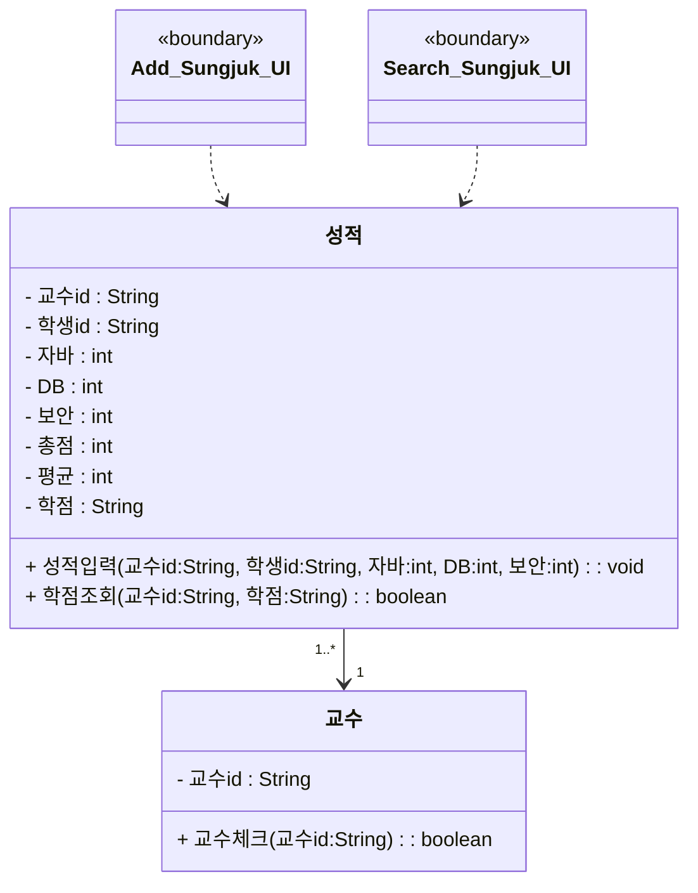

```mermaid
classDiagram

    class 교수 {
        - 교수id : String
        + 교수체크(교수id:String) : boolean
    }

    class 성적 {
        - 교수id : String
        - 학생id : String
        - 자바 : int
        - DB : int
        - 보안 : int
        - 총점 : int
        - 평균 : int
        - 학점 : String
        + 성적입력(교수id:String, 학생id:String, 자바:int, DB:int, 보안:int) : void
        + 학점조회(교수id:String, 학점:String) : boolean
    }

    class Add_Sungjuk_UI {
        <<boundary>>
    }

    class Search_Sungjuk_UI {
        <<boundary>>
    }

    Add_Sungjuk_UI ..> 성적
    Search_Sungjuk_UI ..> 성적
    성적 "1..*" --> "1" 교수
```