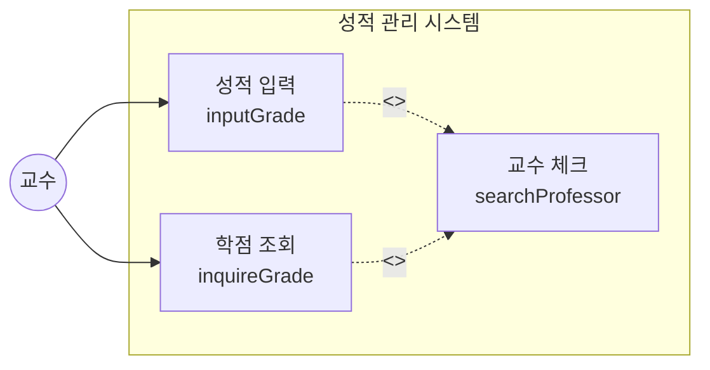

```mermaid
graph LR
    Prof((교수))

    subgraph Grade_Management_System [성적 관리 시스템]
        UC_Input[성적 입력<br/>inputGrade]
        UC_Inquire[학점 조회<br/>inquireGrade]
        UC_Auth[교수 체크<br/>searchProfessor]
    end

    Prof --> UC_Input
    Prof --> UC_Inquire

    UC_Input -. "<<include>>" .-> UC_Auth
    UC_Inquire -. "<<include>>" .-> UC_Auth
```