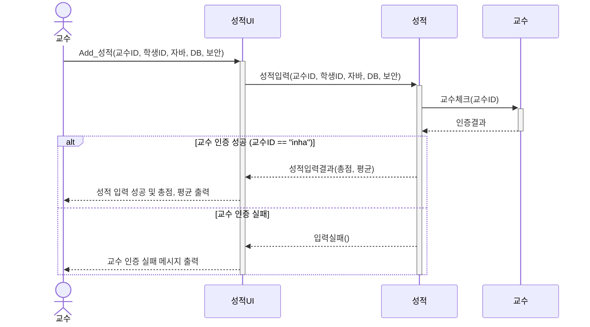

```mermaid
sequenceDiagram
    actor Prof as 교수
    participant UI as 성적UI
    participant Grade as 성적
    participant ProfObj as 교수

    Prof ->>+ UI: Add_성적(교수ID, 학생ID, 자바, DB, 보안)
    UI ->>+ Grade: 성적입력(교수ID, 학생ID, 자바, DB, 보안)

    Grade ->>+ ProfObj: 교수체크(교수ID)
    ProfObj -->>- Grade: 인증결과

    alt 교수 인증 성공 (교수ID == "inha")
        Grade -->> UI: 성적입력결과(총점, 평균)
        UI -->> Prof: 성적 입력 성공 및 총점, 평균 출력
    else 교수 인증 실패
        Grade -->> UI: 입력실패()
        UI -->> Prof: 교수 인증 실패 메시지 출력
    end

    deactivate Grade
    deactivate UI
```