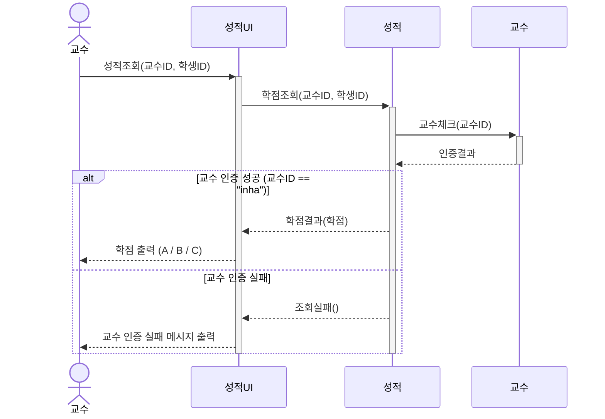

```mermaid
sequenceDiagram
    actor Prof as 교수
    participant UI as 성적UI
    participant Grade as 성적
    participant ProfObj as 교수

    Prof ->>+ UI: 성적조회(교수ID, 학생ID)
    UI ->>+ Grade: 학점조회(교수ID, 학생ID)

    Grade ->>+ ProfObj: 교수체크(교수ID)
    ProfObj -->>- Grade: 인증결과

    alt 교수 인증 성공 (교수ID == "inha")
        Grade -->> UI: 학점결과(학점)
        UI -->> Prof: 학점 출력 (A / B / C)
    else 교수 인증 실패
        Grade -->> UI: 조회실패()
        UI -->> Prof: 교수 인증 실패 메시지 출력
    end

    deactivate Grade
    deactivate UI
```